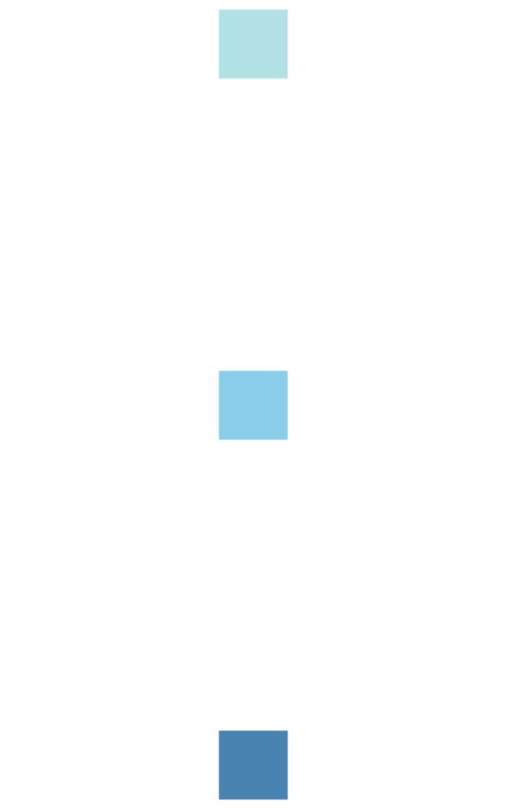
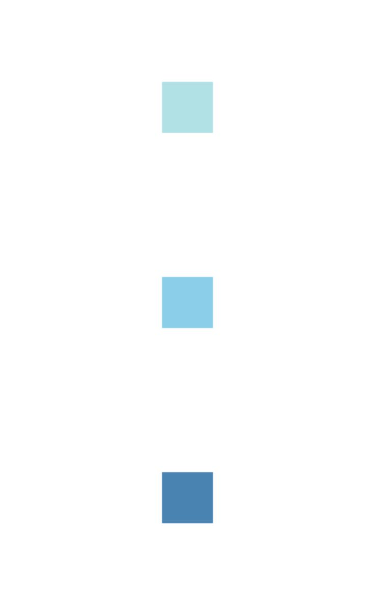

# react-native-row

A wrapper around the react-native `<View/>` component enabling concise assignment of flexbox layout properties. 

The idea is to keep JSX as clean as possible, while removing the need to manage stylesheet declarations for common positioning needs. 

### Installation

    npm install react-native-row

### Basic Usage

Use react-native-row as little or as much as you want. For instance, you could just use the `<Row/>` to replace 

   
        
        
    <View style={{flexDirection: "row"}}/>
    
    
with:

    import Row from react-native-row    
        
    <Row/>
        
        
        
But if you are going to the trouble of installing this module consider these other benefits and weigh the option of reducing stylesheet usage in favor of inline shorthands. The first of which is `dial`
.       

### Dial

One of the most DRY features of react-native-row is the `dial` prop which allows you to replace

    <View style={{flex: 1, flexDirection:"row", justifyContent:"center" alignItems:"center"}}>   
        <View style={{width: 50, height: 50, backgroundColor: 'powderblue'}} />
        <View style={{width: 50, height: 50, backgroundColor: 'skyblue'}} />
        <View style={{width: 50, height: 50, backgroundColor: 'steelblue'}} />
    </View>

with:
         
    <Row dial={5} flex>
      <View style={{width: 50, height: 50, backgroundColor: 'powderblue'}} />
      <View style={{width: 50, height: 50, backgroundColor: 'skyblue'}} />
      <View style={{width: 50, height: 50, backgroundColor: 'steelblue'}} />
    </Row>
        

The child components of `Row` are centered and horizontally aligned 

  
    

Optionally import `View` from this package instead of from `react-native` and all of your `<View/>` components can use dial as well.

    import Row, { View } from react-native-row 
        
    <View dial={5} flex>
      <View style={{width: 50, height: 50, backgroundColor: 'powderblue'}} />
      <View style={{width: 50, height: 50, backgroundColor: 'skyblue'}} />
      <View style={{width: 50, height: 50, backgroundColor: 'steelblue'}} />
    </View>
    

Use `View` without replacing the core RN `View` like so

    import Row, { View as DialView } from 'react-native-view'
     
    <DialView dial={5} flex>
        <View style={{width: 50, height: 50, backgroundColor: 'powderblue'}} />
        <View style={{width: 50, height: 50, backgroundColor: 'skyblue'}} />
        <View style={{width: 50, height: 50, backgroundColor: 'steelblue'}} />
    </DialView>  
    
    
You can also use `spaceBetween` and `spaceAround` to override `justifyContent`:

    <View dial={5} spaceBetween flex>
        
    ...
    

    

    
    <View dial={5} spaceAround flex>
    
      
    ...
    

   

and to `stretch` override `alignItems`

    <View dial={5} stretch flex>
        
    ...
    

    
    

    
    
    
### Flex

    <Row flex/>
    
does this

    <View style={{flex:1, flexDirection: "row"}} />
    
or

    <Row flex={3}/>
    
is

    <View style={{flex:3, flexDirection: "row"}} />

    
### Margin and Padding shorthand

Extra benefits are gained by using react-native-view instead of the core `View` in that you can use shorthands for `margin` and `padding` styles that are based on the css shorthand convention

    <Row margin={[20,15]}/>
    
    
becomes

    <View style={{flexDirection: "row", marginVertical: 20, marginHorizontal: 15}} />

#### margin

Shorthand   | Style Result 
------------ | -------------
`margin={20}` | `{margin: 20}`
`margin={[20]}` | `{marginVertical: 20}`
`margin={[20,15]}` | `{marginVertical: 20, marginHorizontal: 15 }`
`margin={[20,15,10]}` | `{marginTop: 20, marginHorizontal: 15, marginBottom: 10}`
`margin={[20,15,10,5]}` | `{marginTop: 20, marginRight: 15, marginBottom: 10, marginLeft: 5}`

#### padding

Shorthand   | Style Result 
------------ | -------------
`padding={20}` | `{padding: 20}`
`padding={[20]}` | `{paddingVertical: 20}`
`padding={[20,15]}` | `{paddingVertical: 20, paddingHorizontal: 15}`
`padding={[20,15,10]}` | `{paddingTop: 20, paddingHorizontal: 15, paddingBottom: 10}`
`padding={[20,15,10,5]}` | `{paddingTop: 20, paddingRight: 15, paddingBottom: 10, paddingLeft: 5}`

Contributions and issues very much welcome!
